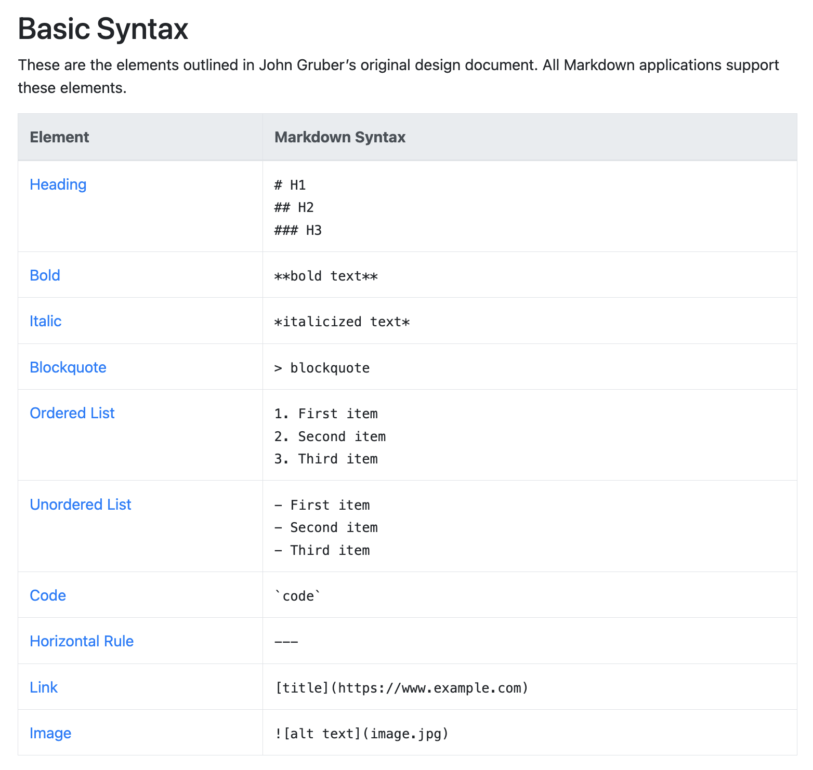

## Agenda

1. Housekeeping
2. How to Write Documentation
3. CSS Positioning

## Housekeeping

1. Attendance
2. Project #1 due tomorrow at midnight
3. Added [glossary](https://github.com/samheckle/hunter-web-projection-1-su26/blob/main/glossary.md)
4. Reading #2 due next week

## How to Write Documentation

Documentation is a way to write about your work as a way of *proactive archival*. Websites don't exist forever! Sometimes you might go to a link and the website is different, or you might run into a 404 not found error. 

Websites can be archived in a couple of ways:
- using a tool to save the website in it's current state (eg. the [Wayback Machine](https://archive.org/) or archive.is)
- taking screenshots and saving them somewhere
- writing about the process so the website can be recreated

We will focus on the last bullet point for our documentation purposes. It serves twofold: insight into your thought process and presenting on your project. **Every project will have documentation associated with it!** 

There are typically 4 things I look for in good documentation:
1. Write about your inspiration.
	- Did you look at reference projects or artists? How did you land on a particular aesthetic? What keywords did you use when searching for this aesthetic? If you made a moodboard, include it.
2. Include any sketches you made *before* you started coding.
	- You can use any tool for these sketches: Illustrator, Procreate, Figma, Miro, Docs, Slides, Pen and paper.
3. Write about your technical process. Take notes *while you are building* on different things you tried and why they felt right or not. 
	- What were things you experimented with? Which one put you on your path for your final design?
	- Take screenshots and screen recordings *while you are building* if there are any surprising visual outputs. I use https://ezgif.com/ to convert videos to gifs. 
	- Include **snippets** of code that you struggled with. I already see the code inside of github, so you don't need to include the entire code files. 
4. Include resources you used for help.
	- If you referenced a Youtube tutorial, a StackOverflow forum, a *specific* reference page (including the entire MDN docs is not helpful whereas including the [position](https://developer.mozilla.org/en-US/docs/Web/CSS/Reference/Properties/position) page is), paste the link into your document.
	- If you used AI (within the bounds laid out in our [syllabus](https://github.com/samheckle/hunter-web-projection-1-su26/tree/main#use-of-generative-artificial-intelligence-ai-tools)), you will need to include the model, version, prompt, and the link to your chat logs. 

You will be writing your documentation in a file called `project-x-documentation.md` that will live in whichever project folder. 

```
└── web-production-1/
    ├── class-demos
    ├── project1/
    │   ├── index.html
    │   ├── style.css
    │   ├── assets/
    │   └── project-1-documentation.md
    ├── project2/
    └── project3/
```

The `.md` extension is "Markdown".
### Using Markdown

Markdown is another way of "marking up" files, similar to HTML. For us, it allows us to quickly write documentation. The moment we make an `.md` file, Github is able to display it without issues (take for example *all* the lecture notes).

You don't need to format your `.md` files if you don't want to. You can also just write paragraphs without any formatting and that is totally fine. 

You can [see a quick Markdown cheatsheet](https://www.markdownguide.org/cheat-sheet/), but we can look at their implementation here:
# Header 1
## Header 2
### Header 3
#### Header 4

We can also use block quotes:

> This is formatted in a block quote style.

We can also make lists:

- item 1
- item 2
- item 3

Or include code blocks:

```
which will take any formatting you tell it to
```

```html
<body>
	<p> this is html formatted </p>
</body>
```

```css
/* this is css formatted */
p{
	color: purple;
}
```
Which adds syntax highlighting of the language you are using. 

If you only want inline formatting, you can use single backticks `to format code inline`.

We can also [add links](https://www.markdownguide.org/cheat-sheet/)

Or images, which are just links with an `!`: 



I would make a `documentation-images` folder in your project if you plan on including a lot of images!

It's pretty simple! If you want a template for documentation, you can find it [here](https://github.com/samheckle/hunter-web-projection-1-su26/blob/main/project-x-documentation-template.md).
## CSS Positioning

### Quick Reference
| Word        | Definition                                                                           | Example                                   |
| ----------- | ------------------------------------------------------------------------------------ | ----------------------------------------- |
| Normal Flow | Regular flow layout of a document using the box model with block and inline elements |                                           |
| Position    | A CSS property that determines where an element exists on a page                     | `static`, `relative`, `absolute`, `fixed` |
### Reference Links to Review
- Tania Rascia [Positioning tutorial](https://www.taniarascia.com/overview-of-css-concepts/#layouts-positioning)
- MDN [`position`](https://developer.mozilla.org/en-US/docs/Web/CSS/Reference/Properties/position) documentation
- MDN [position tutorial](https://developer.mozilla.org/en-US/docs/Learn_web_development/Core/CSS_layout/Positioning)

### Review: `display`, `float`, `overflow`

Manipulating the `display` property allows us to change the flow of elements in a HTML document between horizontally / vertically stacked. 

Changing `float` allows inline elements (including text) to wrap around it. 

`overflow` allows us to enable / disable scroll on a container. 

**Important Note**: If you notice a small scroll on `body`, you probably have some issue with margins. There are a couple of ways to navigate around this:

```css
body{
	margin: 0;
}
```
Or, you can remove the scroll entirely:

```css
body{
	overflow-y: hidden;
}
```
If you notice the tiniest bit of a scroll on the body, typically we want to *remove* it because it is bad web practice.  Try both these methods and see which one works best for your project. 
### The `position` CSS Property

`position` is a CSS property that defaults to `static`, which ensures elements fall into the normal flow of a webpage. We can manipulate the normal flow by changing the `display`, `float`, or `overflow` (as mentioned in [class 4](../class_04/class-04-notes.md#breaking-the-normal-flow)), or with `position`.

`position` can have 4 typical values:
- `static`: default value
	- normal flow *enabled*
- `relative`: sets the origin position of the child elements
	- normal flow *enabled*
- `absolute`: positioned according to the `relative` parent container. 
	- normal flow **disabled**
- `fixed`: same position regardless of scroll
	- normal flow **disabled**
- `sticky`: has an initial relative (normal) position and keeps position when scrolled
	- normal flow *enabled*

**Important Note**: If you use `position: absolute`, you ***need*** to give a parent element `position: relative` to set the origin point. This will allow you to say exactly how many pixels from the origin point as opposed to the top-left corner of the webpage. 


We are seeing these words `relative` and `absolute` a lot, but in the context of CSS it means setting the origin point and how an element position is specified. 

On any element that has `absolute`, `fixed` or `sticky`, we can specify how far from the origin that box is positioned using `top`, `left`, `bottom`, and `right` properties. 

### The `z-index` CSS Property

We can choose how items are layered using `z-index`. A higher number means it is closer towards the user, a lower number is further away. Think of these as customizable layers. 

If you know you want something to always be in the background:

```css
.move-to-back{
	z-index: -999;
}
.move-to-front{
	z-index: 999;
}
```